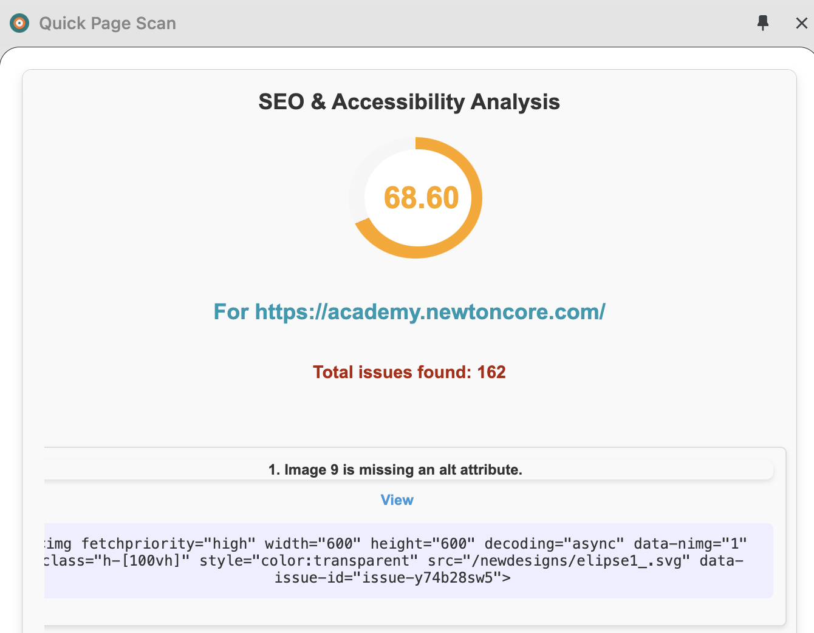
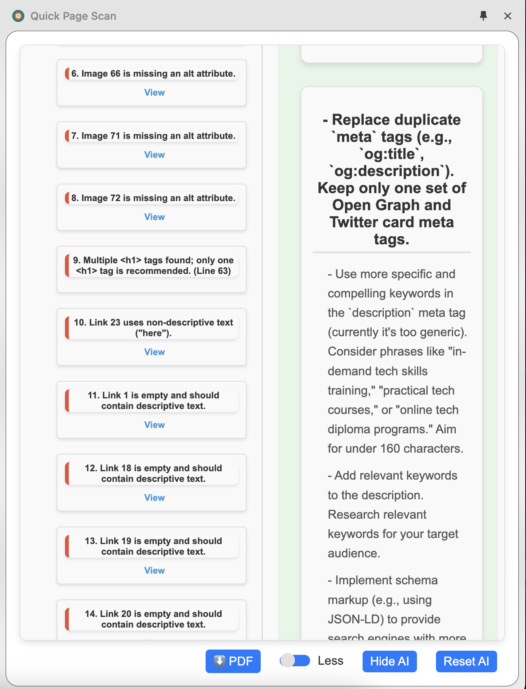

# Quick Page Scan - SEO & Accessibility Analyzer Chrome Extension

**Smarter SEO and accessibility insights without opening your developer tool.**

## Description

The **Quick Page Scan** is a powerful Chrome extension designed to provide actionable insights for improving the SEO and accessibility of web pages. Whether you're a developer, content creator, or SEO specialist, this tool helps you identify issues and offers AI-powered suggestions for optimization.

## Features

### 🚀 **Static Analysis**

- Analyze meta tags, images, links, headings, and other HTML elements.
- Identify missing or improperly configured attributes (e.g., `alt`, `title`, `lang`).
- Receive detailed suggestions for improving on-page SEO and accessibility.

### 🤖 **AI-Powered Suggestions**

- Leverage AI to generate tailored recommendations for enhancing SEO and accessibility.
- Categorized insights:
  - **SEO Improvements**: Optimize tags, images, links, and headings.
  - **Accessibility Enhancements**: Improve ARIA roles, keyboard navigation, and color contrast.
  - **Performance Tips**: General best practices for a better user experience.

### 📊 **Intuitive Interface**

- Clean and user-friendly design with side-by-side analysis and suggestions.
- Easily toggle between **static analysis** and **AI suggestions**.
- Highlight specific issues with detailed context.

### 🖱️ **Seamless Integration**

- Open the extension directly from the Chrome side panel.
- Clear suggestions or refresh the analysis with a single click.

### ⚡ **Additional Features**

- Horizontal scrolling for detailed analysis.
- Loading indicators while fetching AI suggestions.
- Customizable configurations for API endpoints and prompts.

---

## How It Works

1. **Install the Extension**:
   - Download the extension from the Chrome Web Store or load it as an unpacked extension during development.

2. **Analyze Any Web Page**:
   - Open the extension from the Chrome side panel.
   - Perform static analysis or fetch AI-powered suggestions.

3. **Optimize Your Content**:
   - Follow categorized insights to improve your SEO and accessibility scores.

---

## Installation (Development Setup)

1. Clone the repository:
   ```bash
   git clone https://github.com/Yigaue/quick-page-scan-chrome.git
   cd quick-page-scan-chrome

2. Load the extension into Chrome:

  Open Chrome and navigate to chrome://extensions/.
  Enable Developer mode (top-right corner).
  Click Load unpacked and select the project folder.

3. Set your API key:

  Open the `config.js` file and add your API key:

  ```javascript
   export const apiKey = "your-api-key-here"
  ```

1. Start using the extension!


## Screenshots

  
  Static Analysis
  A detailed overview of HTML elements and their issues.

  
  AI-Powered Suggestions
  Tailored recommendations for SEO and accessibility improvements.

## Future Enhancements

  Advanced performance analysis.
  Integration with popular CMS platforms.
  Exportable PDF reports for analysis results.
  Bug fixes.


## Contributing

  Contributions are welcome! If you have ideas or find bugs, feel free to open an issue or submit a pull request.

## License

This project is licensed under the MIT License.

## Testing instructions for application

   1. Environment Setup
   Before testing, ensure the following prerequisites are met:

   Browser: Latest version of Google Chrome.
   Development Mode Enabled:
   Go to chrome://extensions/ in Chrome.
   Enable Developer Mode (toggle in the top-right corner).
   2. Load the Extension
   Open the chrome://extensions/ page.
   Click on Load Unpacked.
   Select the project folder where the extension code resides.
   Verify that the extension loads without errors.

   3. Static Analysis Testing
   Steps:
   Open any webpage in Chrome.
   To open the side panel:
   Click the extension icon in the toolbar OR 
   Select Quick Page Scan from the context menu to open the side panel.
   Review the Static Analysis section.

   Test Cases:
   HTML Tag Analysis:
   Check for issues with meta tags, alt attributes, headings, and links.
   Error Messages:
   Ensure that missing or improperly configured elements are listed with actionable recommendations.
   Interface:
   Verify that issues are displayed in a clean, scrollable format.

   4. AI Suggestions Testing
   Steps:
   In the project file: add your API key in the config.js file generated from Google AI Studio.
   Click the AI Suggestions button.
   Wait for the AI-powered analysis to fetch and display results.

   Test Cases:
   Loading State:
   Verify that a loader appears while waiting for AI suggestions.

   Suggestions Display:
   Ensure that AI suggestions are categorized (SEO, Accessibility, Additional).

   Verify that suggestions are displayed in a structured list with no empty or malformed items.
   Error Handling:
   Test with no API key or invalid API responses to ensure proper error messages are displayed.

   5. Feature Functionality
   Clearing AI Suggestions

   Click the Reset AI button.
   Verify that all displayed AI suggestions are removed.
   Confirm that chrome.storage.local no longer contains stored suggestions.

   Horizontal Scrolling
   Ensure the side-by-side layout for Static Analysis and AI Suggestions supports horizontal scrolling.
